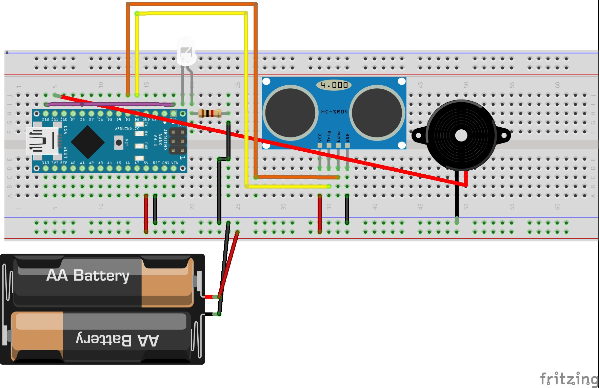

Door-Security-System
===================================

Contribute to design and develop on home security system.
Users will get alert when they appoach to the door that set with sensor for detection.

Getting Started
---------------
Hardware components:
- Arduino Nano
- Breadboard (generic)
- Jumper wires (generic)
- Ultrasonic sensor
- Resistor 10k ohm
- LED (generic)
- 9V Battery or 12V Power supply
- piezo buzzer (generic)

Software apps and online services:
- Arduino Web Editor
- Arduino IDE
- Blynk

## Setup

## Project Image

